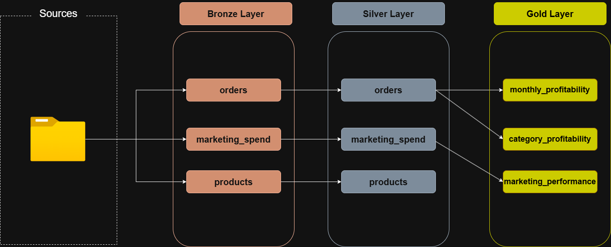
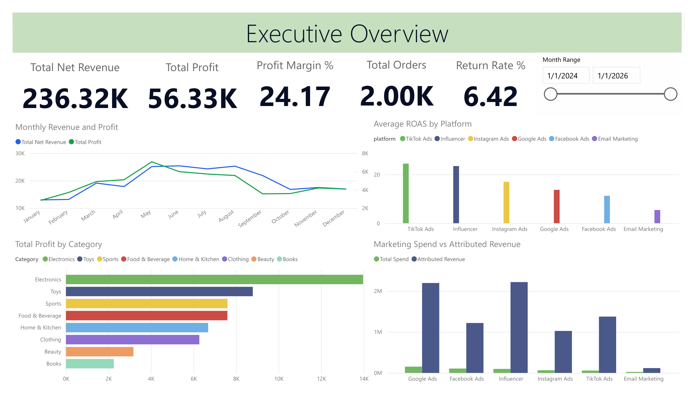

# 🛒 E-Commerce Profitability ETL Project

## 📌 Project Overview

This project is a SQL Server ETL pipeline built to analyze e-commerce profitability, returns, and marketing performance.

The pipeline follows a layered data warehouse approach using **Bronze**, **Silver**, and **Gold** layers.
Raw CSV data is loaded into the Bronze layer, cleaned and transformed in the Silver layer,
and then aggregated into business-ready Gold views for reporting and analysis.

---

## 🏗️ Project Architecture



```text
CSV Files
   ↓
Bronze Layer
   ↓
Silver Layer
   ↓
Gold Layer
   ↓
Reporting & Analysis
```

### Layer Description

| Layer | Purpose |
| :--- | :--- |
| 🥉 Bronze | Stores raw CSV data with minimal transformation. |
| 🥈 Silver | Cleans, standardizes, and converts data into proper SQL data types. |
| 🥇 Gold | Provides aggregated business views for profitability and marketing analysis. |

---

## 📊 Power BI Dashboard

The Gold layer views were used to build an executive Power BI dashboard for profitability, return, and marketing performance analysis.



---

## 📂 Dataset

The project uses three source CSV files:
- `products.csv`
- `orders.csv`
- `marketing_spend.csv`

These files contain product details, order transactions, revenue and cost metrics, return information, and marketing performance data.

---

## 🗄️ Database Objects

### Bronze Tables

- `bronze.products`
- `bronze.orders`
- `bronze.marketing_spend`

### Silver Tables

- `silver.products`
- `silver.orders`
- `silver.marketing_spend`

### Gold Views

- `gold.monthly_profitability`
- `gold.category_profitability`
- `gold.marketing_performance`

---

## 🧾 SQL Scripts

| Script	| Description |
| :--- | :--- |
| `scripts/init_database.sql` | Creates the database and Bronze, Silver, and Gold schemas. |
| `scripts/bronze/ddl_bronze.sql` | Creates Bronze layer tables. |
| `scripts/silver/ddl_silver.sql` | Creates Silver layer tables. |
| `scripts/gold/ddl_gold.sql` | Creates Gold layer analytical views. |
| `scripts/bronze/proc_load_bronze.sql` | Loads raw CSV files into Bronze tables using `BULK INSERT`. |
| `scripts/silver/proc_load_silver.sql` | Transforms and loads data from Bronze to Silver. |
| `test/quality_checks_silver.sql` | Performs data quality checks on the Silver layer. |

---

## 🥇 Gold Layer Views

### `gold.monthly_profitability`

Provides monthly business performance metrics, including:
- total orders
- gross revenue
- net revenue
- total cost
- total profit
- profit margin
- returned orders
- refund amount
- return rate

### `gold.category_profitability`

Provides category-level profitability metrics, including:
- total orders
- total items ordered
- gross revenue
- net revenue
- total cost
- total profit
- average order profit
- profit margin
- return rate

### `gold.marketing_performance`

Provides marketing performance metrics by month and platform, including:
- total spend
- impressions
- clicks
- conversions
- attributed revenue
- CTR
- conversion rate
- CPC
- CPA
- ROAS

---

## ✅ Data Quality Checks

The project includes quality checks for:
- duplicate records
- null key fields
- unwanted spaces in text fields
- invalid dates
- negative numeric values
- ROAS calculation validation
- refund amount validation
- total cost validation

---

## 🚀 How to Run

⚠️ Before running the load procedure, update the CSV file paths in `scripts/bronze/proc_load_bronze.sql` to match your local machine.

1. Run `scripts/init_database.sql`
2. Run `scripts/bronze/ddl_bronze.sql`
3. Run `scripts/silver/ddl_silver.sql`
4. Run `scripts/bronze/proc_load_bronze.sql`
5. Execute the Bronze load procedure:

```sql
EXEC bronze.load_bronze;
```

6. Run `scripts/silver/proc_load_silver.sql`
7. Execute the Silver load procedure:

```sql
EXEC silver.load_silver;
```

8. Run `test/quality_checks_silver.sql`
9. Run `scripts/gold/ddl_gold.sql`

---

## 🔎 Example Queries

```sql
SELECT *
FROM gold.monthly_profitability
ORDER BY [month];
```

```sql
SELECT *
FROM gold.category_profitability
ORDER BY total_profit DESC;
```

```sql
SELECT *
FROM gold.marketing_performance
ORDER BY month_start_date, platform;
```

---

## 📘 Data Catalog

The Gold layer data catalog is documented in:

```text
docs/data_catalog.md
```

It explains the purpose, source, columns, and business meaning of each Gold view.

---

## 🛠️ Requirements

- Microsoft SQL Server
- SQL Server Management Studio or Azure Data Studio
- SQL Server 2022 or later recommended
  - The Gold layer uses `DATETRUNC()`, which is available in SQL Server 2022+

---

## ⚠️ Important Notes

- `scripts/init_database.sql` drops and recreates the database if it already exists.
- `scripts/bronze/proc_load_bronze.sql` uses local CSV paths that must be updated before running.
- Gold views do not include `ORDER BY` because SQL Server views do not guarantee row order. Sorting should be done when querying the view.

---

## 🎯 Project Purpose

This project was created as a portfolio ETL project to demonstrate:
- SQL Server database design
- ETL pipeline development
- Bronze, Silver, and Gold layer architecture
- data cleaning and type conversion
- data quality validation
- analytical SQL view creation
- profitability and marketing performance analysis

---

## 👤 Author
**Václav Benda**
